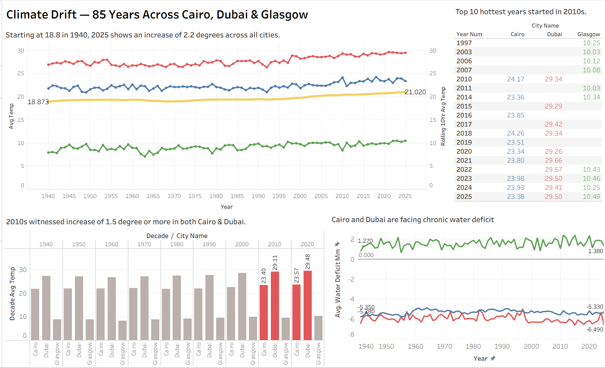

# Climate Drift — 85 Years Across Cairo, Dubai & Glasgow

> *"2023 and 2024 averaged 1.5°C above pre-industrial levels. That's not the threshold breach — the Paris Agreement measures it over 20–30 year averages. So I built a pipeline to check it properly."*
>
> Inspired by: [Why 1.5 Degrees is Backed by Science](https://www.youtube.com/watch?v=V6n3X2CkVkg)

---

## Project Overview

An end-to-end ELT analytics pipeline ingesting 85 years of real daily climate data across three cities on three continents — Cairo, Dubai, and Glasgow — to surface evidence of long-term climate drift.

These are cities I've lived and worked in. The data tells the story better than memory does.

---

## Dashboard



**Key findings:**
- Average temperature across all three cities rose **2.2°C** between 1940 and 2025
- Cairo and Dubai crossed the **1.5°C Paris Agreement threshold** in the 2010s
- **All top 10 hottest years** for Cairo and Dubai occurred after 2010
- Glasgow maintains a **water surplus** while Cairo and Dubai face chronic and deepening water deficit

---

## Stack

| Layer | Tool |
|---|---|
| Source | Open-Meteo Historical API — ERA5 Reanalysis Model |
| File Storage | Google Drive |
| Warehouse | BigQuery External Table (EU region) |
| Transformation | dbt Cloud + VS Code |
| Version Control | Git + GitHub |
| Visualization | Tableau Desktop |

---

## Data Source

**Open-Meteo Historical Weather API — ERA5 model**
https://open-meteo.com/

- Date range: 1940–2025 (~85 years, ~95,000 daily records)
- Cities: Cairo · Dubai · Glasgow

| Variable | Unit | Description |
|---|---|---|
| `temperature_2m_max` | °C | Daily maximum temperature |
| `temperature_2m_min` | °C | Daily minimum temperature |
| `et0_fao_evapotranspiration` | mm | FAO reference evapotranspiration |
| `shortwave_radiation_sum` | MJ/m² | Daily solar energy received |
| `precipitation_sum` | mm | Total daily precipitation |

> **Data quality notes:**
> - ~50 null date records excluded in staging (trailing CSV artifacts)
> - NaN float values in early ERA5 records handled via BigQuery `SAFE_CAST`

---

## dbt Architecture

```
sources (BigQuery External Tables)
    fct_open_meteo_historical_data
    dim_city
        │
        ├── stg_meteo__daily        (view) — cast types, clean NaN, filter nulls
        ├── stg_meteo__cities       (view) — derive city name from lat/lon
        │
        └── int_meteo__joined       (view) — join daily + city, extract year/month
                │
                └── mart_meteo__trends  (table) — annual aggregations + window functions
```


**dbt project:** `Weather_Project_dbt`  
**BigQuery project:** `meteo-historical-project`  
**BigQuery dataset:** `Meteo_Historical_Dataset`

---

## Model Details

### `stg_meteo__daily`
- Casts raw source columns to correct BigQuery types
- Applies `SAFE_CAST` to handle NaN float values in evapotranspiration, solar radiation, and precipitation
- Filters records where `time IS NULL`
- Aliases auto-detected column names to clean snake_case

### `stg_meteo__cities`
- Derives `city_name` from latitude value using `CASE` logic
- Casts lat/lon/elevation to `FLOAT64`

### `int_meteo__joined`
- Left joins daily records to city dimension on `location_id`
- Extracts `year_num` and `month_num` from date
- Selects only columns needed downstream

### `mart_meteo__trends`

**Annual aggregations grouped by city and year:**

| Column | Logic |
|---|---|
| `avg_temp_max` | `ROUND(AVG(temp_max), 2)` |
| `avg_temp_min` | `ROUND(AVG(temp_min), 2)` |
| `avg_temp_mean` | `ROUND(AVG((temp_max + temp_min) / 2), 2)` |
| `avg_solar_radiation_mj` | `ROUND(AVG(solar_radiation_mj), 2)` |
| `avg_precipcation_mm` | `ROUND(AVG(precipitation_mm), 2)` |
| `avg_evapotranspiration_mm` | `ROUND(AVG(evapotranspiration_mm), 2)` |
| `water_deficit_mm` | `AVG(precipitation_mm) - AVG(evapotranspiration_mm)` |
| `decade` | `CAST(FLOOR(year_num / 10) * 10 AS INT64)` |

**Window functions:**

| Column | Function | Purpose |
|---|---|---|
| `rolling_10yr_avg_temp` | `AVG() OVER (ROWS BETWEEN 9 PRECEDING AND CURRENT ROW)` | Smooth annual noise to reveal warming trend |
| `prev_year_avg_temp` | `LAG()` | Previous year temperature |
| `yoy_temp_delta` | `avg_temp_mean - LAG()` | Year-over-year temperature change |
| `hottest_year_rank` | `RANK() DESC` | Rank each year by temperature per city |
| `decade_avg_temp` | `AVG() OVER (PARTITION BY city_name, decade)` | Decade average per city |
| `baseline_decade_avg` | `FIRST_VALUE() ORDER BY decade` | 1940s baseline per city |
| `exceeds_1_5c_threshold` | `CASE WHEN decade_avg_temp - baseline >= 1.5` | Paris Agreement breach flag |

---

## dbt Tests

```yaml
stg_meteo__daily:
  - location_id: not_null
  - date: not_null
  - temp_max: not_null

stg_meteo__cities:
  - location_id: not_null, unique
  - city_name: not_null, accepted_values ['Glasgow', 'Dubai', 'Cairo']
```

---

## Dashboard Charts

| Chart | Insight |
|---|---|
| Temperature trend + 10yr rolling average | Warming signal becomes undeniable once annual noise is smoothed |
| Decade average + 1.5°C flag | Cairo and Dubai crossed threshold in the 2010s — Glasgow has not |
| Water deficit over time | Glasgow surplus vs Cairo/Dubai chronic deficit worsening over the decades |
| Top 10 hottest years | All Cairo and Dubai entries are post-2010 |

---

## Repository Structure

```
weather-project-repo/
├── models/
│   ├── staging/
│   │   ├── stg_meteo__daily.sql
│   │   ├── stg_meteo__cities.sql
│   │   ├── sources.yml
│   │   └── schema.yml
│   ├── intermediate/
│   │   └── int_meteo__joined.sql
│   └── marts/
│       └── mart_meteo__trends.sql
├── tableau/
│   └── Climate Drift Dashboard.twbx
├── dbt_project.yml
└── README.md
```

---

## Author

**Bassem Sayed** — Senior BI & Analytics Engineer, Cairo  
[LinkedIn](https://www.linkedin.com/in/bassemsayed/) · [GitHub](https://github.com/bassem-msayed)

*Part of an ongoing analytics engineering portfolio targeting EU AE and BI leadership roles.*
